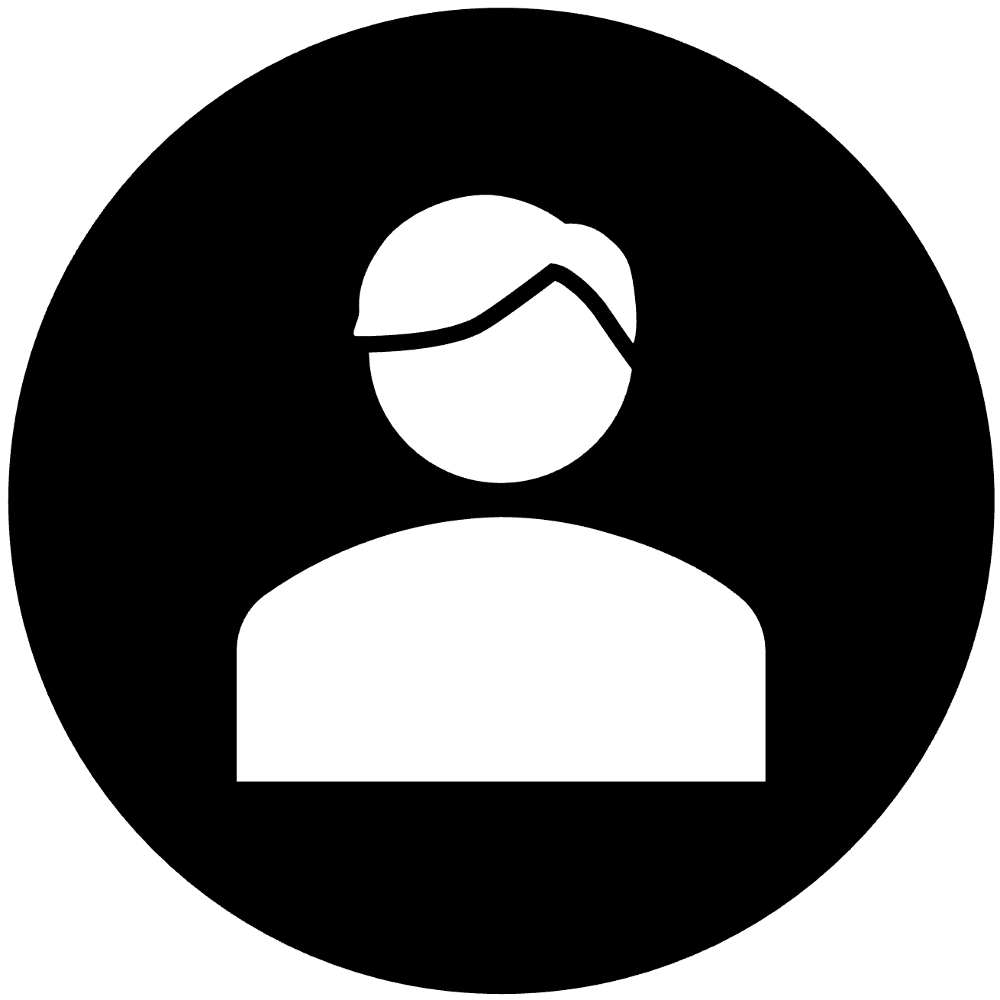

# 🌟 Personal Portfolio Website

<div align="center">
  
  
  [](https://nextjs.org/)
  [](https://www.typescriptlang.org/)
  [](https://tailwindcss.com/)
  [](https://www.framer.com/motion/)
</div>

## 🚀 Features

- ⚡️ Modern and Fast Performance
- 🎨 Stunning Animations with Framer Motion
- 🌓 Dark/Light Mode Support
- 📱 Fully Responsive Design
- 🎯 SEO Optimized
- 💻 Interactive Project Showcase
- 📝 Dynamic Content Management
- 🔍 Clean and Modern UI/UX

## 🛠️ Tech Stack

- **Framework:** Next.js 13 with App Router
- **Language:** TypeScript
- **Styling:** Tailwind CSS
- **Animations:** Framer Motion
- **Icons:** React Icons
- **Deployment:** Vercel

## 🏃‍♂️ Running Locally

1. Clone the repository:

```bash
git clone https://github.com/bereketkib/personal-portofilio.git
```

2. Install dependencies:

```bash
cd personal-portfolio
npm install
```

3. Start the development server:

```bash
npm run dev
```

4. Open http://localhost:3000 in your browser.

## 📁 Project Structure

```plaintext
├── src/
│   ├── app/             # App router pages
│   ├── components/      # Reusable components
│   ├── data/           # Static data and content
├── public/             # Static assets
└── tailwind.config.ts  # Tailwind configuration
```

## 🎨 Key Components

- Hero Section: Dynamic and engaging introduction
- Projects Showcase: Interactive project cards with animations
- Experience Timeline: Visual representation of professional journey
- Contact Section: Multiple contact options with animated cards

## 🌐 Live Demo

Visit the live website: [Your Portfolio URL]

## 📝 License

This project is licensed under the MIT License - see the LICENSE file for details.

## 🤝 Contact

Bereket Kibreab - bekibreab@gmail.com

Made with ❤️ by Bereket Kibreab

```

```
